<h1 align="center">
  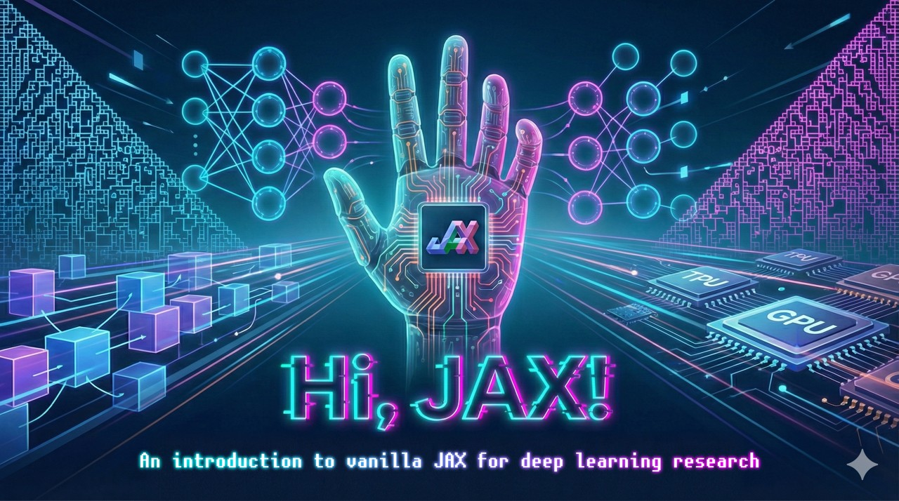
</h1>

<p align="center">
  
  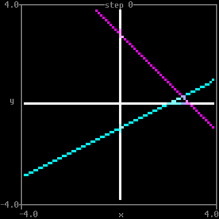
  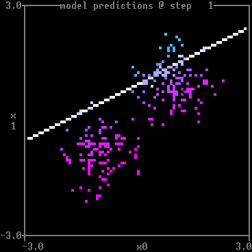
  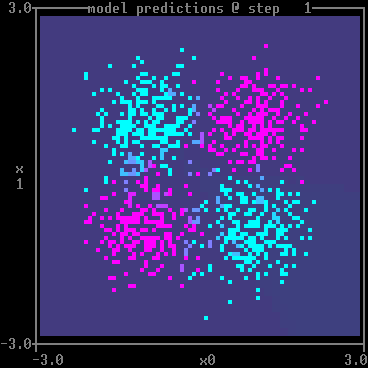
  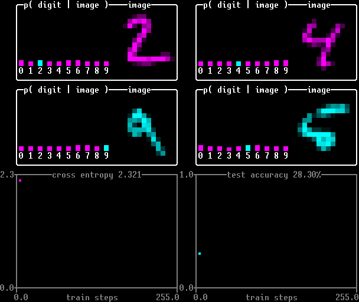
  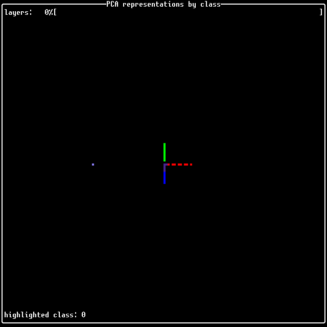
  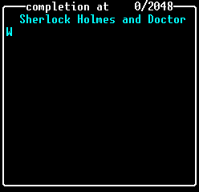
  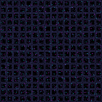
  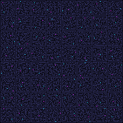
  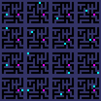
</p>
      
Welcome to "Hi, JAX!", an introduction to vanilla
  [JAX](https://jax.readthedocs.io/)
for deep learning researchers.

  
Contents:

* [Why learn JAX?](#why-learn-jax)
* [Prerequisites](#prerequisites)
* [Syllabus](#syllabus)
  * [Overture](#overture)
  * [Act I: Basics](#act-i-basics)
  * [Act II: Acceleration](#act-ii-acceleration)
  * [Finale](#finale)
  * [Projects](#projects)
* [Getting started](#getting-started)
* [Beyond the fundamentals](#beyond-the-fundamentals)
* [Citing Hi, JAX!](#citing-hi-jax)
* [Credits](#credits)

This course is a work in progress. Here is the current status:
* Code examples implemented: 12/12.
* Videos recorded, edited, published: 11/12.
  ([subscribe](https://www.youtube.com/@MatthewFarrugiaRoberts) to hear when
  more are posted!)

Banner image designed by Gemini 3 Pro and generated by Nano Banana Pro (by the
way, both of these models were trained with JAX). Animations mostly made with
  [matthewplotlib](https://github.com/matomatical/matthewplotlib),
a Python terminal plotting library in development.

# Why learn JAX?

I'm a deep learning scientist. I try to understand the natural principles
underpinning the structure and function of learned neural networks. In the
course of my research, I have to train, test, and dissect many neural networks,
large and small. Neural networks are essentially just arrays of floating point
parameters, so the best way to interact with them is using an array programming
library. That is where JAX comes in.

[JAX](https://jax.readthedocs.io/) is a Python library for writing and
transforming array programs. The JAX API for writing array programs is similar
to that of NumPy, but the JAX API for *transforming* array programs is utterly
unique, effortlessly powerful, and delightfully elegant.

Since switching from using PyTorch to using JAX for my research, I have
personally noticed the following benefits.

1. **JAX is fast.** The main selling point of JAX is its integration with the
   XLA array program compiler. XLA gives a speed boost for even small-scale JAX
   programs, which run multiple times faster than uncompiled array programs,
   even on the same processors.

2. **JAX is portable.** JAX isn't just useful on GPUs. It's equally happy to
   optimise code I want to run on my M2 Air. When I do need to reach for more
   compute, I don't have to cough up for a GPU node, I can take advantage of
   Google's TPU Research Cloud programme and run my code on a free TPU cluster.

3. **JAX is elegant.** Deep learning researchers describe their insights with
   the powerful abstractions forged over hundreds of years by mathematicians.
   The JAX library's design celebrates mathematical abstractions, rather than
   over-fitting to some subset of methods that happen to be in vogue.

4. **JAX is good for your code.** It can be challenging to comply with the
   various restrictions JAX enforces (immutability, pure functions, static
   shapes). But even if they weren't justified by the powerful optimisations
   they enable, these restrictions are all good ways to make code more
   explicit, readable, and, ultimately, less wrong.

JAX isn't perfect. But it's far and away the closest to my conception of the
ideal array programming library. Plus, it's under active development by a team
that has shown they can get the big picture *so right,* so the future looks
bright.

All else equal, I'd choose JAX for my projects, every time. Of course, all else
is not always equal. Here are some reasons people might not want to switch to
JAX.

1. **JAX is less popular.** It hasn't been around as long as PyTorch, which has
   a larger and more well-resourced ecosystem. If you switch to JAX, you might
   have to write more code yourself when the paper you want to replicate or the
   architecture you want to try provides a PyTorch codebase. Your colleagues
   might refuse to port their existing code to work with JAX.

   *But you are not alone.* While still small *relative* to the PyTorch
   ecosystem, the JAX ecosystem is decent in *absolute* terms today. There are
   many 
     [awesome JAX](https://github.com/n2cholas/awesome-jax)
   tools out there and I see new projects posted every week. Maybe I will see
   your contribution one day?

2. **JAX is hard to learn.** Using JAX requires thinking about array programs
   in new ways. You will encounter challenges you have no idea how to solve,
   and this will make you feel like you're a beginner programmer again. This is
   difficult, and there aren't many learning resources out there that convey
   the "JAX mindset."
   
   *That changes, now.* I went through this journey myself. It took me months
   to crack the "JAX mindset." But I did eventually crack it, and now I have
   made this course---including programming demonstrations drawn from real
   challenges I came up against when learning JAX.

I can feel which way the wind is blowing. Can you?

# Prerequisites

Programming:

* Prior experience programming in Python
  (e.g., collections, dataclasses, functools, type annotations).
* Prior experience programming in NumPy.
  * NumPy [basics](https://numpy.org/doc/stable/user/absolute_beginners.html)
    tutorial should be sufficient.
* Prior experience with einops.
  * Einops [basics](https://einops.rocks/1-einops-basics/)
    tutorial more than sufficient.

Machine learning:

* Basic vector calculus and optimisation (stochastic gradient descent).
* Basic deep learning architectures (MLP, CNN, Transformer).
  * [3Blue1Brown Season 3](https://www.youtube.com/playlist?list=PLZHQObOWTQDNU6R1_67000Dx_ZCJB-3pi)
    should be sufficient (skip chapter 4).

*Helpful/optional (we will cover what is required):*

* Basic reinforcement learning
    (Markov decision process formalism, policy gradients).
* Prior experience programming in, e.g., Rust
    (the concept of immutability).
* Prior experience programming in, e.g., Haskell
    (the concepts of pure functions, mapping, folding).

You will need a Python environment (but not necessarily a GPU) if you want to
code along during the workshops.

# Syllabus

The course comprises the following:

* **12 Lectures**
  ([YouTube playlist](https://www.youtube.com/playlist?list=PLjl5MxRQg5xrQagVEKk9J5eWWZf6AmYSr))**:**
  Recorded coding demonstrations where we walk line by line through
  implementing a deep learning projects.

  The lectures are organised into four parts:

  * [**Overture**](#overture) (1 lecture)**:** A taste of what is to come.

  * [**Act I: Basics**](#act-i-basics) (5 lectures)**:** Fundamental JAX
    programming concepts.

  * [**Act II: Acceleration**](#act-ii-acceleration) (5 lecture)**:** The ins
    and outs of just-in-time compilation.

  * [**Finale**](#finale) (1 lecture)**:** In which we bring it all together.
  
  You can follow along using the starting code and solutions found in this
  repository.

* **12 Challenges:** Each lecture ends with a challenge, which is a small
  open-ended project for you to work on using similar techniques to those
  demonstrated in the lecture.

  You should aim to complete each challenge after following the lecture, to
  solidify your understanding of the new concepts.

* **1+ Projects:** After finishing the 12 lectures and challenges, you will be
  ready for a more ambitious project of your own. There are some suggestions
  [below](#projects), mainly replicating deep learning papers in JAX or diving
  into low-level optimisation details.


## Overture

In which we first meet JAX and get a taste of how it differs from NumPy.

<table>
<thead>
  <th width="20%">Preview</th>
  <th width="25%">YouTube Video</th>
  <th width="55%">Lecture Description</th>
</thead>
<tbody>
  <tr>
    <td align="center">
      
    </td>
    <td align="center">
      <a href="https://youtu.be/HJeeMnLs_Z0&list=PLjl5MxRQg5xrQagVEKk9J5eWWZf6AmYSr">
        
      </a>
    </td>
    <td>
      <p><strong>Hi, JAX! How’s life?</strong> Quick overview of JAX features, <code>jax.numpy</code> library.</p>
      <ul>
        <li><p>Demonstration: Port elementary cellular automaton simulator from NumPy to JAX.</p></li>
        <li><p>Challenge: Accelerated Conway’s game of life simulator.</p></li>
      </ul>
    </td>
  </tr>
</tbody>
</table>

## Act I: Basics

In which we learn the elementary components of JAX programs while implementing and training increasingly complex neural networks.

<table>
<thead>
  <th width="20%">Preview</th>
  <th width="25%">YouTube Video</th>
  <th width="55%">Lecture Description</th>
</thead>
<tbody>
  <tr>
    <td align="center">
      
    </td>
    <td align="center">
      <a href="https://youtu.be/sXQHNZcqIPg&list=PLjl5MxRQg5xrQagVEKk9J5eWWZf6AmYSr">
        
      </a>
    </td>
    <td>
      <p><strong>Hi, automatic differentiation!</strong> Functional model API, <code>jax.grad</code> transformation.</p>
      <ul>
        <li><p>Demonstration: Train a teacher–student linear regression model with full-batch gradient descent.</p></li>
        <li><p>Challenge: Train the teacher as well as the student.</p></li>
      </ul>
    </td>
  </tr>

  <tr>
    <td align="center">
      
    </td>
    <td align="center">
      <a href="https://youtu.be/O9RQbC23Kf0&list=PLjl5MxRQg5xrQagVEKk9J5eWWZf6AmYSr">
        
      </a>
    </td>
    <td>
      <p><strong>Hi, procedural random number generation!</strong> Immutable PRNG state management, <code>jax.random</code> library.</p>
      <ul>
        <li><p>Demonstration: Implement and train a classical perceptron with classical SGD.</p></li>
        <li><p>Challenge: Implement and train a multi-layer perceptron.</p></li>
      </ul>
    </td>
  </tr>

  <tr>
    <td align="center">
      
    </td>
    <td align="center">
      <a href="https://youtu.be/dpUaDZyBBX8&list=PLjl5MxRQg5xrQagVEKk9J5eWWZf6AmYSr">
        
      </a>
    </td>
    <td>
      <p><strong>Hi, PyTrees!</strong> PyTrees, <code>jax.tree.map</code>.</p>
      <ul>
        <li><p>Demonstration: Implement and train an MLP with minibatch SGD.</p></li>
        <li><p>Challenge: Add additional layers to the MLP.</p></li>
      </ul>
    </td>
  </tr>

  <tr>
    <td align="center">
      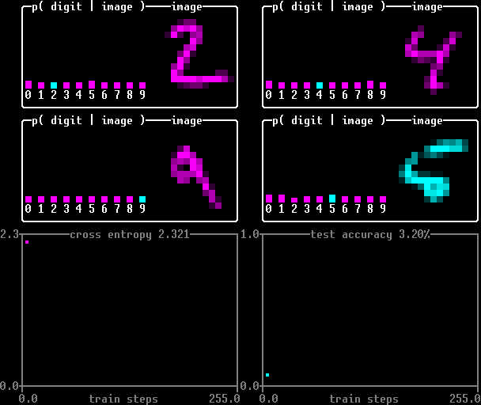
    </td>
    <td align="center">
      <a href="https://youtu.be/dpUaDZyBBX8&list=PLjl5MxRQg5xrQagVEKk9J5eWWZf6AmYSr">
        
      </a>
    </td>
    <td>
      <p><strong>Hi, automatic vectorisation!</strong> Vectorisation with <code>jax.vmap</code>.</p>
      <ul>
        <li><p>Demonstration: Implement and train a CNN on MNIST with minibatch SGD.</p></li>
        <li><p>Challenge: Train an ensemble of CNNs.</p></li>
      </ul>
    </td>
  </tr>

  <tr>
    <td align="center">
      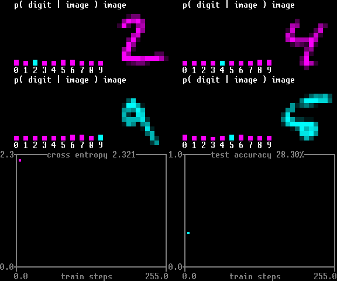
    </td>
    <td align="center">
      <a href="https://youtu.be/Su40NhzNeTQ&list=PLjl5MxRQg5xrQagVEKk9J5eWWZf6AmYSr">
        
      </a>
    </td>
    <td>
      <p><strong>Hi, stateful optimisation!</strong> Managing state during a training loop.</p>
      <ul>
        <li><p>Demonstration: Implement Adam in vanilla JAX.</p></li>
        <li><p>Challenge: Implement Adam with weight decay.</p></li>
      </ul>
    </td>
  </tr>
</tbody>
</table>

## Act II: Acceleration

In which we explore various aspects of just-in-time compilation and the kinds of tricks we need to use to prepare our computational graphs for the XLA compiler.

<table>
<thead>
  <th width="20%">Preview</th>
  <th width="25%">YouTube Video</th>
  <th width="55%">Lecture Description</th>
</thead>
<tbody>
  <tr>
    <td align="center">
      
    </td>
    <td align="center">
      <a href="https://youtu.be/9Af1jguxNeQ&list=PLjl5MxRQg5xrQagVEKk9J5eWWZf6AmYSr">
        
      </a>
    </td>
    <td>
      <p><strong>Hi, just-in-time compilation!</strong> Compilation with <code>jax.jit</code>, tracing versus execution, side-effects, debugging tools.</p>
      <ul>
        <li><p>Demonstration: JIT dojo, accelerate CNN training on MNIST.</p></li>
        <li><p>Challenge: Implement and train a residual network.</p></li>
      </ul>
    </td>
  </tr>

  <tr>
    <td align="center">
      
    </td>
    <td align="center">
      <a href="https://youtu.be/xb8FN-4Acto&list=PLjl5MxRQg5xrQagVEKk9J5eWWZf6AmYSr">
        
      </a>
    </td>
    <td>
      <p><strong>Hi, loop acceleration!</strong> Looping computations with <code>jax.lax.scan</code>.</p>
      <ul>
        <li><p>Demonstration: Accelerate a whole forward pass and a whole training loop.</p></li>
        <li><p>Challenge: Vectorise a hyperparameter sweep and tune the learning rate for one of our previous models.</p></li>
      </ul>
    </td>
  </tr>

  <tr>
    <td align="center">
      
    </td>
    <td align="center">
      <a href="https://youtu.be/Db-0dcdsPXs&list=PLjl5MxRQg5xrQagVEKk9J5eWWZf6AmYSr">
        
      </a>
    </td>
    <td>
      <p><strong>Hi, static arguments!</strong> Compile errors due to non-static shapes, flagging static arguments.</p>
      <ul>
        <li><p>Demonstration: Implement and train a byte-transformer on the Sherlock Holmes canon.</p></li>
        <li><p>Challenge: Add dropout modules to the transformer.</p></li>
      </ul>
    </td>
  </tr>

  <tr>
    <td align="center">
      
    </td>
    <td align="center">
      <a href="https://youtu.be/939ymw03viI&list=PLjl5MxRQg5xrQagVEKk9J5eWWZf6AmYSr">
        
      </a>
    </td>
    <td>
      <p><strong>Hi, branching computation!</strong> Stateful environment API, conditional computation with <code>jax.lax.select</code>, <code>jax.numpy.where</code>, and expression-level branching.</p>
      <ul>
        <li><p>Demonstration: Implement a simple grid-world maze environment.</p></li>
        <li><p>Challenge: Add a locked door and a key to the grid-world environment.</p></li>
      </ul>
    </td>
  </tr>

  <tr>
    <td align="center">
      
    </td>
    <td align="center">
      <a href="https://youtu.be/phY3XijGHcM&list=PLjl5MxRQg5xrQagVEKk9J5eWWZf6AmYSr">
        
      </a>
    </td>
    <td>
      <p><strong>Hi, algorithms!</strong> Performance considerations for branching computation and parallelism, <code>jax.lax.while</code>.</p>
      <ul>
        <li><p>Demonstration: Comparative implementation of Kruskal’s minimum spanning tree algorithm with different union–find data structures.</p></li>
        <li><p>Challenge: Determine solvability of a maze by implementing and accelerating <a href="https://en.wikipedia.org/wiki/Depth-first_search">depth-first search</a>.
          Or, solve the maze by implementing and accelerating <a href="https://en.wikipedia.org/wiki/Breadth-first_search">breadth-first search</a>.
          Or, for a harder challenge, implement and accelerate the <a href="https://en.wikipedia.org/wiki/Floyd%E2%80%93Warshall_algorithm">Floyd–Warshall algorithm</a> to compute all-pairs shortest paths.</p></li>
      </ul>
    </td>
  </tr>
</tbody>
</table>

## Finale

In which we bring together everything we have learned to accelerate an end-to-end deep reinforcement learning environment simulation and training loop, one of the most effective uses of JAX for deep learning.

<table>
<thead>
  <th width="20%">Preview</th>
  <th width="25%">YouTube Video</th>
  <th width="55%">Lecture Description</th>
</thead>
<tbody>
  <tr>
    <td align="center">
      
    </td>
    <td align="center">
      Lecture 11
      <br>
      (coming soon...)
    </td>
    <td>
      <p><strong>Hi, deep reinforcement learning!</strong> Revision of previous fundamental topics, reverse <code>scan</code>.</p>
      <ul>
        <li><p>Demonstration: Accelerated PPO with GAE, train a policy to solve a small maze.</p></li>
        <li><p>Challenge: Solve larger mazes.</p></li>
      </ul>
    </td>
  </tr>
</tbody>
</table>


## Projects

The best way to consolidate your understanding is to implement your own
non-trivial JAX project. As a suggestion, you could choose one of the following
research replication projects on the topics of mechanistic interpretability and
the science of deep learning.

1.  **Hi, mechanistic interpretability!**
    Take some image model we have trained and then switch to optimising over
    the space of input images (rather than parameters) to produce a feature
    visualisation for some neuron along the lines of
      [[1](https://distill.pub/2017/feature-visualization/)].

2.  **Hi, computational mechanics!**
    Implement a simple HMM generative process and train a transformer on this
    data, then probe for belief state geometry in the residual stream,
    replicating figures 4BCD and 6A from
      [[2](https://arxiv.org/abs/2405.15943)].

3.  **Hi, sparse autoencoders!**
    Take an existing image model we have trained and then train a sparse
    autoencoder (SAE) on it to produce a feature visualisation along the
    lines of 
      [[3](https://arxiv.org/abs/2406.03662)].

4.  **Hi, singular learning theory!**
    Implement local learning coefficient estimation and then replicate (a
    rescaled version of) figure 3 from
      [[4](https://arxiv.org/abs/2308.12108)]

5.  **Hi, science of deep learning!**
    Implement a synthetic in-context linear regression data generator and
    in-context dMMSE and ridge regression algorithmic baselines, and then train
    a transformer to replicate a (low-resolution or small-architecture version
    of) figure 2 from
      [[5](https://arxiv.org/abs/2306.15063)].

6.  **Hi, goal misgeneralisation!**
    Implement the "cheese in the corner" environment including the distribution
    shift, and the domain randomisation RL algorithm, and train a policy to
    replicate the black line from figures 4(left) and H.1 (bottom left) from
      [[6](https://arxiv.org/abs/2507.03068)].

For those with a need for more speed and scale, you may be interested in this
advanced self-study project instead:

7.  **Hi, profiling tools!**
    Learn how to use JAX
    [profiling](https://docs.jax.dev/en/latest/profiling.html)
    [tools](https://docs.jax.dev/en/latest/device_memory_profiling.html),
    then find and remove a 2x memory or runtime bottleneck in the `hijax`
    GitHub repository.

8.  **Hi, distributed training!**
    Learn how to use
      [distributed data loading](https://docs.jax.dev/en/latest/distributed_data_loading.html)
    and
      [automatic parallelism](https://docs.jax.dev/en/latest/notebooks/Distributed_arrays_and_automatic_parallelization.html),
    then find a hardware and hyperparameter configuration for some learning
    task where parallelism leads to an order of magnitude speed-up.

Whatever project you select, please let me know if you complete it! And if you
like, I would be delighted list your name and a link to your completed project
here:

* *2024.07.27*
  [Billy Snikkers](https://www.billysnikkers.net/)
  completed a custom project (training a neural network to implement the update
  rule from Conway's game of life)
    [[repo](https://github.com/blinkybool/hijax/tree/main/32hr_challenge)].

* *2024.08.07*
  [Rohan Hitchcock](https://rohanhitchcock.com/)
  completed project 4 (Hi, singular learning theory!)
    [[repo](https://github.com/rohan-hitchcock/hijax)].


# Getting started

Watch the
  [getting started video](https://www.youtube.com/watch?v=tbG-ePhoqbA&list=PLjl5MxRQg5xrQagVEKk9J5eWWZf6AmYSr),
or follow these instructions:

Create a virtual environment, for example with
  [uv](https://docs.astral.sh/uv/getting-started/installation/#pypi):

```
uv venv hijax.venv
```

Enter the virtual environment:

```
source hijax.venv/bin/activate
```

Install the requirements:

```
uv pip install -r requirements.txt
```

Note: That command will install JAX to use the CPU.

* If you want to run JAX on a GPU with CUDA 13: `pip install jax[cuda13]`
* If you want to run JAX on a TPU: `pip install jax[tpu]`
* More generally see the
  [JAX installation instructions](https://docs.jax.dev/en/latest/installation.html)

From there, you should be able to follow along with each video tutorial.


# Beyond the fundamentals

Mastering the fundamentals of JAX is valuable because vanilla JAX is a powerful
tool for accelerated Python programming.

That's great, but there's no reason you have to stick to vanilla JAX. There is
a growing ecosystem of libraries that builds on top of JAX. Here is an
incomplete and opinionated overview of some of the libraries I have come across
(based on my own experience by late 2025, mostly deep learning related).

**Neural network modules:** You would apparently be spoiled for choice. Each of
the following options has its own way of specifying a set of neural network
parameters with some variant of an init/forward API. I have personally found
myself coming back to the vanilla style developed in this course for my own
(small-scale) projects.

* Patrick Kidger's [equinox](https://docs.kidger.site/equinox/) hews closest to
  the JAX philosophy and would be my recommendation if people don't want to
  roll their own modules.
  (equinox is more than just a neural network module library, and I am happy to
  recommend it generally.)

* Google DeepMind's [Flax NNX](https://flax.readthedocs.io/en/latest/index.html)
  I have not had the opportunity to try, but from what I have seen it looks
  like it betrays the JAX philosophy in some important ways and I am not
  excited to try it.

* Flax NNX is a new project born in the GDM merger, deprecating two now legacy
  libraries that you might still see around:
  [Flax Linen](https://flax-linen.readthedocs.io/en/latest/) (from Google
  proper) and [Haiku](https://dm-haiku.readthedocs.io/en/latest/) (from
  DeepMind). I have tried Flax Linen and became frustrated by it. I considered
  but didn't get into Haiku.

**Optimisation:** We built our own Adam implementation in lecture 05 for
pedagogical reasons, but in practice I would definitely use `optax`:

* [Optax](https://optax.readthedocs.io/en/latest/index.html) is a library for
  processing and applying gradients to models, and it has your back for
  optimisers, regularisers, learning rate schedules, and more.

**Checkpointing:** For when you want to save models or training state so that
you can pick back up where you left off or evaluate your models layer. As far
as I am aware this space is monopolised by a library from Google:

* [orbax.checkpoint](https://orbax.readthedocs.io/en/latest/api_reference/checkpoint.html),
  Whenever I have touched orbax I have became extremely frustrated about
  inconsistent documentation and about how many imports and objects are
  required to do very simple things (I'm sure it works great at Google scale
  but seems overengineered for my use-cases).

**Data loading:** A bit of a blind spot for the JAX ecosystem. I normally work
with synthetic data or RL so I can get away without it, but I have heard of
these tools:
      
* Google's [`grain`](https://github.com/google/grain), maybe useful for larger
  scale systems, seems like it would make simple things painful?

* It's possible to use dataloaders from other frameworks, including
    [TensorFlow](https://docs.jax.dev/en/latest/notebooks/neural_network_with_tfds_data.html)
  or
    [PyTorch](https://docs.jax.dev/en/latest/notebooks/Neural_Network_and_Data_Loading.html),
  and convert the data to JAX at load time.

* [HuggingFace data-loading](https://huggingface.co/docs/datasets/en/use_with_jax#data-loading)
  has been recommended.

Here are two related tutorials
  [(1)](https://docs.jaxstack.ai/en/latest/data_loaders_on_cpu_with_jax.html)
  [(2)](https://docs.jaxstack.ai/en/latest/data_loaders_on_gpu_with_jax.html).

**Environments:** TODO: There are many cool environment libraries for RL in
JAX. I haven't used these myself, instead building my own suite of
  [procedurally generated grid-worlds for studying goal misgeneralisation](https://github.com/matomatical/jaxgmg).
However some libraries I have noted include:

* [gymnax](https://github.com/RobertTLange/gymnax):
    Something like gymnasium.
* [Jumanji](https://github.com/instadeepai/jumanji):
    Combinatorial games and other puzzles.
* [Octax](https://github.com/riiswa/octax):
    Arcade game emulator.
* [Craftax](https://github.com/MichaelTMatthews/Craftax):
    2d Minecraft-like + roguelike.
* [Pgx](https://github.com/sotetsuk/pgx): for board games.
* Plus a few more in my link queue!

Whatever well-known pre-JAX RL environment you are looking for, these days it
seems pretty likely something you are looking for, these days it's quite
possible there is a JAX version or there will be one soon?

**Beyond deep learning:**
  [Awesome JAX](https://github.com/n2cholas/awesome-jax)
is a GitHub repository maintaining a list of JAX libraries. They also have
learning resources, papers, blog posts, and more.

**Learning more about JAX:** If you want to learn more about JAX, here are some
good resources to know about.

* Your first port of call should **always** be the official JAX
    [documentation](https://jax.readthedocs.io/en/latest/),
  which offers beginner and advanced tutorials, advice on frequent issues, a
  detailed API reference, and more.

* For another hands-on introduction to JAX, see the University of Amsterdam's
  Deep Learning Course
    [notebooks](https://uvadlc-notebooks.readthedocs.io/en/latest/tutorial_notebooks/JAX/tutorial2/Introduction_to_JAX.html)
  has tutorials covering basic JAX and various deep learning topics implemented
  in JAX.

* Two short informative tutorials I enjoyed were (1)
  An [ACM SIGPLAN tutorial](https://www.youtube.com/watch?v=BzuEGdGHKjc) from
  Matthew Johnson (JAX developer)
  and a [PyCon tutorial](https://www.youtube.com/watch?v=yDYiiVVkBXY) from
  Simon Pressler.

# Citing Hi, JAX!

Let me be clear that the code developed as part of this course is often
simplified for pedagogical reasons and may not be directly appropriate for deep
learning research.

However, if for some reason you find the code or teaching materials useful in
your academic work, and you want to cite "Hi, JAX!", you can use the following
bibtex:

```
@misc{farrugia2026hijax,
    title={{Hi, JAX!} An introduction to {JAX} for deep learning research},
    author={Matthew Farrugia-Roberts},
    year={2026},
    note={Access via \href{https://github.com/matomatical/hijax}{github.com/matomatical}},
}
```

# Credits

This course was created by Matthew Farrugia-Roberts.

I would like to thank the participants in the
  [2024 metauni cohort](https://far.in.net/hijax-2024)
for their encouragement while I developed the course. I would particularly
like to thank Billy Snikkers for all the great questions and feedback.

I would like to thank members of the OAISI and orchard communities for their
encouragement while I was preparing the revised syllabus and recording the
videos for this edition of the course. I would particularly like to thank
Louis Thomson for the recording equipment and advice and for support with
design and YouTube, and Billy Snikkers for yet more great feedback.

---

Bye!
